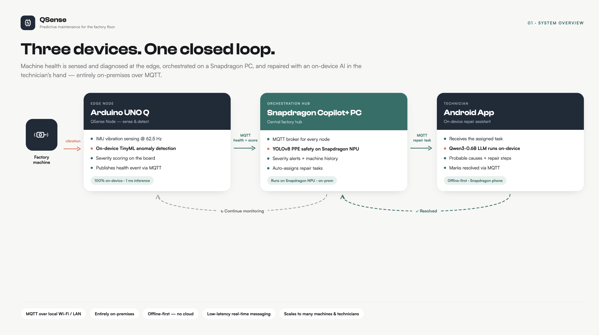
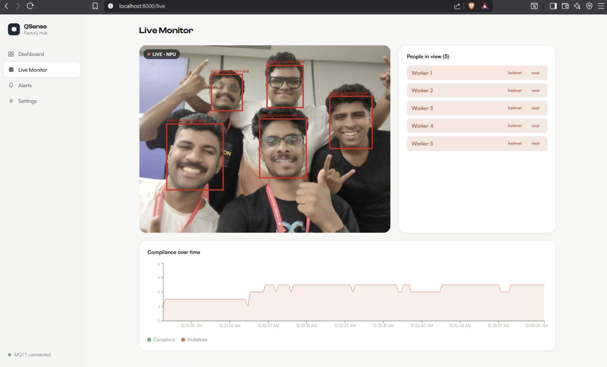

# QSense

**Edge-AI predictive maintenance + worker safety for MSME factories**

Team Vibe Check · Snapdragon Multiverse Hackathon, Bengaluru · July 11–12, 2026

A magnetically-attached retrofit kit that watches machines and workers, catches problems early, and walks a technician through the fix — entirely offline, on the factory floor. No cloud, no data leaves the floor.

This is the umbrella repo for the project. It ties together three devices working as one closed loop. Each device has its own repo with full setup and run instructions — this README covers the overall workflow and links out to them.



▶️ **[Watch the demo](https://www.youtube.com/shorts/cTYB6zcPg5c)**

## The three repos

| Stage | Device | Repo | What it does |
|---|---|---|---|
| **Node** | Arduino UNO Q | [QSense-Node](https://github.com/VibeCheck-Q/QSense-Node) | On-device vibration anomaly detection |
| **Web** | Snapdragon Copilot+ PC | [QSense-Web](https://github.com/VibeCheck-Q/QSense-Web) | MQTT hub, dashboard, alerting, PPE detection |
| **App** | Snapdragon phone (OnePlus 15) | [QSense-App](https://github.com/VibeCheck-Q/QSense-App) | On-device repair diagnosis assistant |

Full dependencies, build steps, and run commands live in each repo's own README — this doc only covers what each stage does and how they connect.

## Getting started

```bash
git clone --recurse-submodules git@github.com:VibeCheck-Q/QSense.git
# already cloned without --recurse-submodules?
git submodule update --init --recursive
```

## How it works — the closed loop

```
Detect (Node) ──► Manage (Web) ──► Repair (App)
     ▲                                    │
     └───────────────── Resolve ──────────┘
```

### 1. Detect — Arduino UNO Q ([QSense-Node](https://github.com/VibeCheck-Q/QSense-Node))

- Continuous IMU vibration sampling
- On-device TinyML anomaly detection, trained with Edge Impulse — Keras for classification, K-means for anomaly detection
- Network architecture: 1 input layer, 2 dense hidden layers, 1 output layer
- Model performance: **100% F1 score**, 1.7K peak RAM, 20.0K flash usage, 1 ms inference time
- Deployed to the Arduino UNO Q via App Lab's `vibration_anomaly_detection` brick, plus a `web_ui` brick that shows per-device details
- Publishes anomaly events to MQTT

**Output:** machine ID, affected component, anomaly score, timestamp

### 2. Manage — Snapdragon Copilot+ PC ([QSense-Web](https://github.com/VibeCheck-Q/QSense-Web))

- MQTT broker receives anomaly events from all QSense Nodes
- Stores machine history and event logs
- Generates severity-based alerts
- Runs NPU-accelerated PPE detection on the live camera feed
- Displays a real-time factory dashboard
- Automatically assigns the repair task to the appropriate technician
- Publishes the assigned task to the technician's mobile device

Acts as the central orchestration hub for the factory.

### 3. Repair — Snapdragon phone ([QSense-App](https://github.com/VibeCheck-Q/QSense-App))

- Technician receives the assigned task
- Views machine and fault details
- On-device LLM (RAG-grounded) generates ranked causes and fixes — no cloud round-trip, works even with poor network coverage
- Technician marks the job resolved once fixed

### 4. Resolve — the loop closes

- Resolution is published back over MQTT
- Dashboard alert clears
- Node's baseline resets and monitoring resumes

## Tech at a glance

- **Node** — Edge Impulse (Keras + K-means), Arduino UNO Q, 100% F1 / 1.7K RAM / 20.0K flash / 1 ms inference
- **Web** — Python, FastAPI, Mosquitto MQTT, NPU-accelerated YOLOv8m PPE detection, SQLite, React dashboard
- **App** — Kotlin Multiplatform + Compose, on-device LLM (GenieX) with RAG grounding, MQTT client

## License

MIT. See each module's repo for its own `LICENSE` file.

## Team — Vibe Check

- Salman Faris
- Shaan Shoukath
- Abdul Samad MJ
- Mohammed Nawf
- Mohamed Jasim CM


